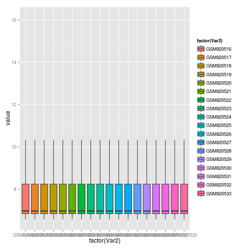
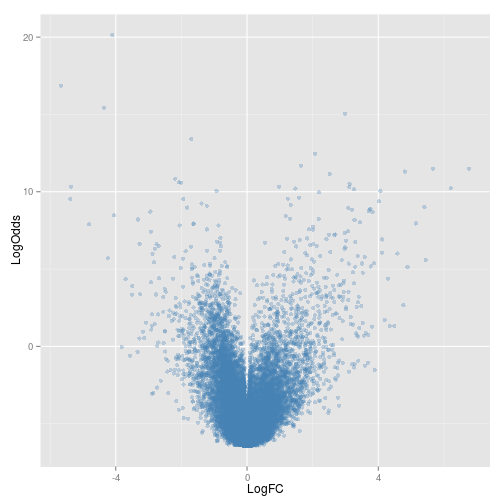

New beadarray functionality
========================================================

A demonstration of the proposed new functionality for beadarray

```r

library(beadarray)
```

```
## Loading required package: BiocGenerics
## Loading required package: parallel
## 
## Attaching package: 'BiocGenerics'
## 
## The following objects are masked from 'package:parallel':
## 
##     clusterApply, clusterApplyLB, clusterCall, clusterEvalQ,
##     clusterExport, clusterMap, parApply, parCapply, parLapply,
##     parLapplyLB, parRapply, parSapply, parSapplyLB
## 
## The following object is masked from 'package:stats':
## 
##     xtabs
## 
## The following objects are masked from 'package:base':
## 
##     anyDuplicated, append, as.data.frame, as.vector, cbind,
##     colnames, duplicated, eval, evalq, Filter, Find, get,
##     intersect, is.unsorted, lapply, Map, mapply, match, mget,
##     order, paste, pmax, pmax.int, pmin, pmin.int, Position, rank,
##     rbind, Reduce, rep.int, rownames, sapply, setdiff, sort,
##     table, tapply, union, unique, unlist
## 
## Loading required package: Biobase
## Welcome to Bioconductor
## 
##     Vignettes contain introductory material; view with
##     'browseVignettes()'. To cite Bioconductor, see
##     'citation("Biobase")', and for packages 'citation("pkgname")'.
## 
## Loading required package: ggplot2
## Welcome to beadarray version 2.13.2
## beadarray versions >= 2.0.0 are substantial updates from beadarray 1.16.0 and earlier. Please see package vignette for details
```

```r
library(GEOquery)
```

```
## Setting options('download.file.method.GEOquery'='curl')
```

```r
library(limma)
```

```
## 
## Attaching package: 'limma'
## 
## The following object is masked from 'package:beadarray':
## 
##     imageplot
## 
## The following object is masked from 'package:BiocGenerics':
## 
##     plotMA
```

```r
library(GenomicRanges)
```

```
## Loading required package: IRanges
## 
## Attaching package: 'IRanges'
## 
## The following object is masked from 'package:beadarray':
## 
##     collapse
## 
## Loading required package: XVector
```


A proposal is to faciliate the analyis of publicly-available data. We download the following example


```r

url <- "ftp://ftp.ncbi.nih.gov/pub/geo/DATA/SeriesMatrix/GSE33126/"
filenm <- "GSE33126_series_matrix.txt.gz"
if (!file.exists("GSE33126_series_matrix.txt.gz")) download.file(paste(url, 
    filenm, sep = ""), destfile = filenm)
gse <- getGEO(filename = filenm)
```

```
## File stored at: 
## /tmp/RtmpJoTabB/GPL6947.soft
```

```r
head(exprs(gse))
```

```
##              GSM820516 GSM820517 GSM820518 GSM820519 GSM820520 GSM820521
## ILMN_1343291   66665.4   69404.7   64128.1   68944.0   67827.2   71775.3
## ILMN_1343295   22040.1   13046.3   38679.0   16641.9   33719.9   18933.3
## ILMN_1651199     226.6     205.4     217.2     229.0     226.3     203.9
## ILMN_1651209     278.6     253.7     211.8     278.0     259.8     265.2
## ILMN_1651210     195.5     196.0     175.3     193.9     229.6     164.1
## ILMN_1651221     217.3     206.1     219.6     205.0     194.7     234.0
##              GSM820522 GSM820523 GSM820524 GSM820525 GSM820526 GSM820527
## ILMN_1343291   62245.6   69713.7   69509.3   68244.6   65427.5   68436.5
## ILMN_1343295   26170.0    9906.9   17166.5   12429.0   25297.6   17535.6
## ILMN_1651199     213.4     210.4     229.5     212.7     226.1     232.2
## ILMN_1651209     321.3     273.4     253.6     310.2     275.0     275.0
## ILMN_1651210     244.7     191.0     188.1     199.3     220.6     213.4
## ILMN_1651221     233.2     222.1     244.2     209.8     227.8     256.0
##              GSM820528 GSM820529 GSM820530 GSM820531 GSM820532 GSM820533
## ILMN_1343291   57608.7   69959.8   69509.3   70063.8   69647.2   70332.3
## ILMN_1343295   19749.1   17854.3   43670.7   22849.1   23725.7   28747.0
## ILMN_1651199     208.7     229.3     214.4     216.7     195.7     252.2
## ILMN_1651209     250.6     255.9     219.6     292.5     253.3     238.0
## ILMN_1651210     194.8     173.7     185.3     174.7     195.4     191.9
## ILMN_1651221     233.5     194.4     218.7     271.5     222.8     241.1
```


We can convert into a beadarray object


```r

summaryData <- ExpressionSetFromGEO(gse)
```

```
## Loading required package: illuminaHumanv3.db
## Loading required package: AnnotationDbi
## Loading required package: org.Hs.eg.db
## Loading required package: DBI
```

```r
summaryData
```

```
## ExpressionSetIllumina (storageMode: list)
## assayData: 48803 features, 18 samples 
##   element names: exprs, se.exprs, nObservations, Detection 
## protocolData: none
## phenoData
##   sampleNames: GSM820516 GSM820517 ... GSM820533 (18 total)
##   varLabels: title geo_accession ... data_row_count (31 total)
##   varMetadata: labelDescription
## featureData
##   featureNames: ILMN_1343291 ILMN_1343295 ... ILMN_2416019 (48803
##     total)
##   fvarLabels: Row.names ID ... PROBESEQUENCE (8 total)
##   fvarMetadata: labelDescription
## experimentData: use 'experimentData(object)'
## Annotation: Humanv3 
## QC Information
##  Available Slots:  
##   QC Items: 
##   sampleNames:
```

```r
head(fData(summaryData))
```

```
##                 Row.names           ID               nuID      Species
## ILMN_1343291 ILMN_1343291 ILMN_1343291 97viJ90hzUX_rZ.nvY Homo sapiens
## ILMN_1343295 ILMN_1343295 ILMN_1343295 9fQSYRUddRf4Z6p6T4 Homo sapiens
## ILMN_1651199 ILMN_1651199 ILMN_1651199 6OYpVKvaVZJlni1ChY Homo sapiens
## ILMN_1651209 ILMN_1651209 ILMN_1651209 60abGV06oA3Va4f0rU Homo sapiens
## ILMN_1651210 ILMN_1651210 ILMN_1651210 o7oTiLy97.l5Guommw Homo sapiens
## ILMN_1651221 ILMN_1651221 ILMN_1651221 EllV59GiXrVNBZYKng Homo sapiens
##               SYMBOL PROBEQUALITY     CODINGZONE
## ILMN_1343291  EEF1A1      Perfect Transcriptomic
## ILMN_1343295   GAPDH      Perfect Transcriptomic
## ILMN_1651199    <NA>          Bad     Intergenic
## ILMN_1651209 SLC35E2      Perfect Transcriptomic
## ILMN_1651210    <NA>          Bad     Intergenic
## ILMN_1651221  EFCAB1          Bad Transcriptomic
##                                                   PROBESEQUENCE
## ILMN_1343291 TGTGTTGAGAGCTTCTCAGACTATCCACCTTTGGGTCGCTTTGCTGTTCG
## ILMN_1343295 CTTCAACAGCGACACCCACTCCTCCACCTTTGACGCTGGGGCTGGCATTG
## ILMN_1651199 ATGCGAGGCCCCAGGGTTCGGCCCCGCAGCGCCGCTGAGTCCAAGGACCG
## ILMN_1651209 TCACGGCGTACGCCCTCATGGGGAAAATCTCCCCGGTGACTTTCAGGTCC
## ILMN_1651210 TGTGGACATGAGAGTTAGTTCTGTTTTGCCTGCACGGTGGGAGCGGCGTA
## ILMN_1651221 GCCGCCCCCTGCTTCACGGAGCCTGGTCCCATCAACCGCCGAAGGGCTGA
```


Detection scores could be added by using the no match probes as negative controls. Possibly we could assignment of status when the object is created?


```r

fData(summaryData)$Status <- ifelse(fData(summaryData)$PROBEQUALITY == "No match", 
    "negative", "regular")

Detection(summaryData) <- calculateDetection(summaryData, status = fData(summaryData)$Status)
```


Likewise for normalisation


```r
summaryData.norm <- normaliseIllumina(summaryData, method = "neqc", status = fData(summaryData)$Status)
```

```
## Subsetting....
```

```r
boxplot(summaryData.norm)
```

```
## Warning: Removed 6187 rows containing missing values (geom_point).
## Warning: Removed 6184 rows containing missing values (geom_point).
## Warning: Removed 6188 rows containing missing values (geom_point).
## Warning: Removed 6190 rows containing missing values (geom_point).
## Warning: Removed 6182 rows containing missing values (geom_point).
## Warning: Removed 6191 rows containing missing values (geom_point).
## Warning: Removed 6187 rows containing missing values (geom_point).
## Warning: Removed 6192 rows containing missing values (geom_point).
## Warning: Removed 6185 rows containing missing values (geom_point).
## Warning: Removed 6186 rows containing missing values (geom_point).
## Warning: Removed 6191 rows containing missing values (geom_point).
## Warning: Removed 6189 rows containing missing values (geom_point).
## Warning: Removed 6188 rows containing missing values (geom_point).
## Warning: Removed 6187 rows containing missing values (geom_point).
## Warning: Removed 6193 rows containing missing values (geom_point).
## Warning: Removed 6190 rows containing missing values (geom_point).
## Warning: Removed 6187 rows containing missing values (geom_point).
## Warning: Removed 6193 rows containing missing values (geom_point).
```

 


The user has to be able to select a column to use as Sample Groups


```r
pData(summaryData)[1:3, ]
```

```
##                               title geo_accession                status
## GSM820516 C1 (gene expression data)     GSM820516 Public on Nov 26 2012
## GSM820517 C2 (gene expression data)     GSM820517 Public on Nov 26 2012
## GSM820518 C3 (gene expression data)     GSM820518 Public on Nov 26 2012
##           submission_date last_update_date type channel_count
## GSM820516     Oct 20 2011      Nov 26 2012  RNA             1
## GSM820517     Oct 20 2011      Nov 26 2012  RNA             1
## GSM820518     Oct 20 2011      Nov 26 2012  RNA             1
##           source_name_ch1 organism_ch1 characteristics_ch1
## GSM820516           tumor Homo sapiens       tissue: Colon
## GSM820517          normal Homo sapiens       tissue: Colon
## GSM820518           tumor Homo sapiens       tissue: Colon
##           characteristics_ch1.1 characteristics_ch1.2 molecule_ch1
## GSM820516            patient: 1  t=tumor; n=normal: T    total RNA
## GSM820517            patient: 1  t=tumor; n=normal: N    total RNA
## GSM820518            patient: 2  t=tumor; n=normal: T    total RNA
##                                                                                                                                                                                                                                                                                                                                                                                                                                                                                                                                                                                                                                                                                                                                                                                   extract_protocol_ch1
## GSM820516 Tissues were mechanically disrupted and simultaneously homogenized in the presence of QIAzol Lysis reagent (Qiagen, Valencia, CA, USA), using a Mikrodismembrator (Braun Biotech International, Melsungen, Germany). RNA was extracted using the miRNeasy Mini kit (Qiagen) according to manufacturer’s instructions, followed by clean-up and DNase I treatment with QIAGEN RNeasy mini kit. RNA concentrations were measured with the NanoDrop ND-100 Spectrophotometer (NanoDrop Technologies, Wilmington, DE) while RNA quality was assessed with the Agilent 2100 Bioanalyzer (Agilent Technologies, Palo Alto, CA) using the RNA 6000 Nano kit (Agilent Technologies). Samples, included in the present analysis, had a RIN score greater than 5 and a 28S:18S rRNA ratio near to 2:1.
## GSM820517 Tissues were mechanically disrupted and simultaneously homogenized in the presence of QIAzol Lysis reagent (Qiagen, Valencia, CA, USA), using a Mikrodismembrator (Braun Biotech International, Melsungen, Germany). RNA was extracted using the miRNeasy Mini kit (Qiagen) according to manufacturer’s instructions, followed by clean-up and DNase I treatment with QIAGEN RNeasy mini kit. RNA concentrations were measured with the NanoDrop ND-100 Spectrophotometer (NanoDrop Technologies, Wilmington, DE) while RNA quality was assessed with the Agilent 2100 Bioanalyzer (Agilent Technologies, Palo Alto, CA) using the RNA 6000 Nano kit (Agilent Technologies). Samples, included in the present analysis, had a RIN score greater than 5 and a 28S:18S rRNA ratio near to 2:1.
## GSM820518 Tissues were mechanically disrupted and simultaneously homogenized in the presence of QIAzol Lysis reagent (Qiagen, Valencia, CA, USA), using a Mikrodismembrator (Braun Biotech International, Melsungen, Germany). RNA was extracted using the miRNeasy Mini kit (Qiagen) according to manufacturer’s instructions, followed by clean-up and DNase I treatment with QIAGEN RNeasy mini kit. RNA concentrations were measured with the NanoDrop ND-100 Spectrophotometer (NanoDrop Technologies, Wilmington, DE) while RNA quality was assessed with the Agilent 2100 Bioanalyzer (Agilent Technologies, Palo Alto, CA) using the RNA 6000 Nano kit (Agilent Technologies). Samples, included in the present analysis, had a RIN score greater than 5 and a 28S:18S rRNA ratio near to 2:1.
##           label_ch1
## GSM820516    biotin
## GSM820517    biotin
## GSM820518    biotin
##                                                                               label_protocol_ch1
## GSM820516 Total RNA from each sample was labeled according to the manufacturers recommendations.
## GSM820517 Total RNA from each sample was labeled according to the manufacturers recommendations.
## GSM820518 Total RNA from each sample was labeled according to the manufacturers recommendations.
##           taxid_ch1                             hyb_protocol
## GSM820516      9606 Standard Illumina hybridization protocol
## GSM820517      9606 Standard Illumina hybridization protocol
## GSM820518      9606 Standard Illumina hybridization protocol
##                                 scan_protocol  description
## GSM820516 Standard Illumina scanning protocol 4660559081_A
## GSM820517 Standard Illumina scanning protocol 4660559081_G
## GSM820518 Standard Illumina scanning protocol 4668112004_B
##                                                  data_processing
## GSM820516 The data were extracted  with BeadStudio software v3.8
## GSM820517 The data were extracted  with BeadStudio software v3.8
## GSM820518 The data were extracted  with BeadStudio software v3.8
##           platform_id    contact_name                      contact_email
## GSM820516     GPL6947 Loris,,De Cecco loris.dececco@istitutotumori.mi.it
## GSM820517     GPL6947 Loris,,De Cecco loris.dececco@istitutotumori.mi.it
## GSM820518     GPL6947 Loris,,De Cecco loris.dececco@istitutotumori.mi.it
##                         contact_institute contact_address contact_city
## GSM820516 IRCSS Istituto Nazionale Tumori  via Venezian 1        Milan
## GSM820517 IRCSS Istituto Nazionale Tumori  via Venezian 1        Milan
## GSM820518 IRCSS Istituto Nazionale Tumori  via Venezian 1        Milan
##           contact_zip/postal_code contact_country supplementary_file
## GSM820516                   20133           Italy               NONE
## GSM820517                   20133           Italy               NONE
## GSM820518                   20133           Italy               NONE
##           data_row_count
## GSM820516          48803
## GSM820517          48803
## GSM820518          48803
```


```r
summaryData.norm <- setSampleGroup(summaryData.norm, pData(summaryData)$source_name_ch1)

summaryData.norm <- simpleDE(summaryData.norm)

lapply(summaryData.norm@deResults, head)
```

```
## $PValue
##               Contrasts
##                normal-tumor
##   ILMN_1343291      0.01954
##   ILMN_1343295      0.00519
##   ILMN_1651199      0.58731
##   ILMN_1651209      0.34198
##   ILMN_1651210      0.14014
##   ILMN_1651221      0.72686
## 
## $LogFC
##               Contrasts
##                normal-tumor
##   ILMN_1343291      0.08385
##   ILMN_1343295     -0.67556
##   ILMN_1651199      0.01462
##   ILMN_1651209      0.05275
##   ILMN_1651210     -0.05360
##   ILMN_1651221      0.01372
## 
## $LogOdds
##               Contrasts
##                normal-tumor
##   ILMN_1343291       -3.558
##   ILMN_1343295       -2.323
##   ILMN_1651199       -6.282
##   ILMN_1651209       -5.959
##   ILMN_1651210       -5.285
##   ILMN_1651221       -6.373
```

```r

beadarray:::volcanoplot(summaryData.norm)
```

 


A useful for function for picking the 'best' probe for each gene based on IQR (by default)


```r
collapse
```

```
## standardGeneric for "collapse" defined from package "IRanges"
## 
## function (x) 
## standardGeneric("collapse")
## <environment: 0x4814af0>
## Methods may be defined for arguments: x
## Use  showMethods("collapse")  for currently available ones.
```

```r
geneData <- beadarray:::collapse(summaryData)
```

```
## Error: no 'dimnames' attribute for array
```

```r
geneData
```

```
## Error: object 'geneData' not found
```


A function that will get genomic locations for each probe and create a RangedData object


```r
rng <- toRangedData(summaryData)
```

